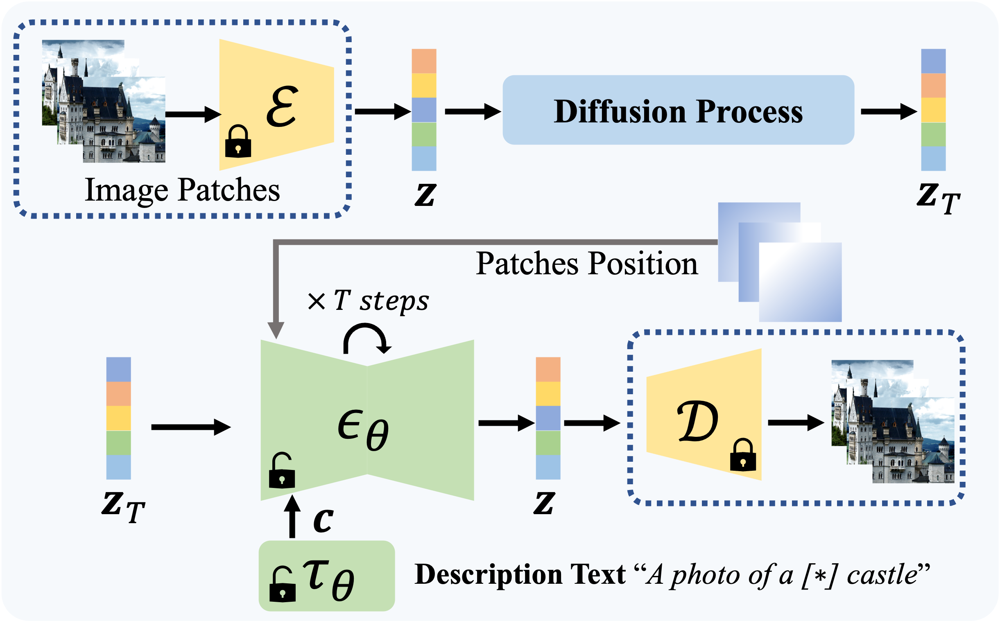
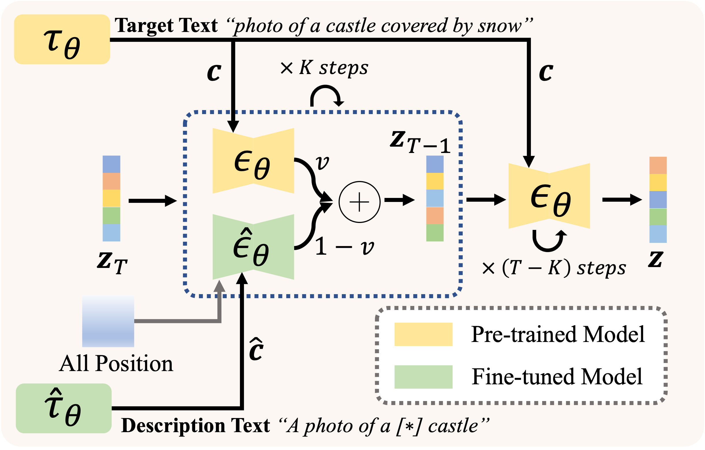

## SINE <br><sub> <ins>SIN</ins>gle Image <ins>E</ins>diting with Text-to-Image Diffusion Models</sub>

[](https://colab.research.google.com/github/zhang-zx/SINE/blob/master/SINE.ipynb)


[Project](https://zhang-zx.github.io/SINE/) |
[ArXiv](https://arxiv.org/abs/2212.04489) 


This respository contains the code for the paper [SINE: SINgle Image Editing with Text-to-Image Diffusion Models](https://arxiv.org/abs/2212.04489).
For more visualization results, please check our [webpage](https://zhang-zx.github.io/SINE/).

> **[SINE: SINgle Image Editing with Text-to-Image Diffusion Models](https://zhang-zx.github.io/SINE/)** \
> [Zhixing Zhang](https://zhang-zx.github.io/) <sup>1</sup>,
> [Ligong Han](https://phymhan.github.io/) <sup>1</sup>,
> [Arnab Ghosh](https://arnabgho.github.io/) <sup>2</sup>,
> [Dimitris Metaxas](https://people.cs.rutgers.edu/~dnm/) <sup>1</sup>,
> and [Jian Ren](https://alanspike.github.io/) <sup>2</sup> \
> <sup>1</sup> Rutgers University
> <sup>2</sup> Snap Inc.

<div align="center">
    <a></a>
    <a></a>
</div>

## Setup

First, clone the repository and install the dependencies:

```bash
git clone git@github.com:zhang-zx/SINE.git
```

Then, install the dependencies following the [instructions](https://github.com/CompVis/stable-diffusion#stable-diffusion-v1).

Alternatively, you can also try to use the following docker image.

```bash
docker pull sunggukcha/sine
```


To fine-tune the model, you need to download the [pre-trained model](https://huggingface.co/CompVis/stable-diffusion-v-1-4-original/resolve/main/sd-v1-4-full-ema.ckpt).

### Data Preparation

The data we use in the paper can be found from [here](https://drive.google.com/drive/folders/1oD2gwMkR25BvaXobuCrDyOn0_xI-dlmF?usp=sharing).

### Pre-trained Models

We provide some of the fine-tuned models together with the corresonding inference configuration files in the following:

|Image | config | ckpt|
|:---:|:---:|:---:|
|[castle](https://drive.google.com/file/d/1HB1kQPs_zGToC2-toEUxA1MGgI025fy4/view?usp=share_link)| [patch-based config](./configs/stable-diffusion/v1-inference_patch.yaml) |[ckpt](https://drive.google.com/drive/folders/1yNmXyZ1v5gsLE6LpWqBL3mdl3TL053lh?usp=share_link)|
|[castle](https://drive.google.com/file/d/1-nHalzFmgDd4ZYk29H_Qh8srZslRpqeA/view?usp=share_link)| [w/o patch-based config](./configs/stable-diffusion/v1-inference.yaml) |[ckpt](https://drive.google.com/drive/folders/1bcdBKZtcPJDhDD35gb9Xm90rVd21IQJJ?usp=share_link)|
|[dog](https://drive.google.com/file/d/1JB4fYoZM3mYkDQmduJM7CPbiPFrrhLep/view?usp=share_link)| [patch-based config](./configs/stable-diffusion/v1-inference_patch.yaml) |[ckpt](https://drive.google.com/drive/folders/1YJ7BGo3F56U2LRzfYqPeJzXn8C_ULK-k?usp=share_link)|
|[dog](https://drive.google.com/file/d/1JB4fYoZM3mYkDQmduJM7CPbiPFrrhLep/view?usp=share_link)| [w/o patch-based config](./configs/stable-diffusion/v1-inference.yaml) |[ckpt](https://drive.google.com/drive/folders/1UHVxbcF5Wnf6ilxVys8Sv8hsbN-4s1Y5?usp=share_link)|
|[Girl with a peral earring](https://drive.google.com/file/d/1wiXBATzjdLCh727vmMhx9EMB6cAmOJhI/view?usp=share_link)|[patch-based config](./configs/stable-diffusion/v1-inference_patch_nearest_interp.yaml) |[ckpt](https://drive.google.com/drive/folders/1ynukjVh4K_5OOlAfHFsiqzAIiub8qmTi?usp=share_link)|
|[Monalisa](https://drive.google.com/file/d/1DkFxhouR8jqvJcF9tE0fqCCquPpS5C1J/view?usp=share_link)|[patch-based config](./configs/stable-diffusion/v1-inference_patch_nearest_interp.yaml) |[ckpt](https://drive.google.com/drive/folders/1k6w-RHZVflwHKMovHYvOD_QsE2WzKHYv?usp=share_link)|

## Fine-tuning

### Fine-tuning w/o patch-based training scheme

```bash
IMG_PATH=path/to/image
CLS_WRD='coarse class word'
NAME='name of the experiment'

python main.py \
    --base configs/stable-diffusion/v1-finetune_picture.yaml \
    -t --actual_resume /path/to/pre-trained/model \
    -n $NAME --gpus 0,  --logdir ./logs \
    --data_root $IMG_PATH \
    --reg_data_root $IMG_PATH --class_word $CLS_WRD 
```

### Fine-tuning with patch-based training scheme

```bash
IMG_PATH=path/to/image
CLS_WRD='coarse class word'
NAME='name of the experiment'

python main.py \
    --base configs/stable-diffusion/v1-finetune_patch_picture.yaml \
    -t --actual_resume /path/to/pre-trained/model \
    -n $NAME --gpus 0,   --logdir ./logs \
    --data_root $IMG_PATH \
    --reg_data_root $IMG_PATH --class_word $CLS_WRD  
```

## Model-based Image Editing

### Editing with one model's guidance

```bash
LOG_DIR=/path/to/logdir
python scripts/stable_txt2img_guidance.py --ddim_eta 0.0 --n_iter 1 \
    --scale 10 --ddim_steps 100 \
    --sin_config configs/stable-diffusion/v1-inference.yaml \
    --sin_ckpt $LOG_DIR"/checkpoints/last.ckpt" \
    --prompt "prompt for pre-trained model[SEP]prompt for fine-tuned model" \
    --cond_beta 0.4 \
    --range_t_min 500 --range_t_max 1000 --single_guidance \
    --skip_save --H 512 --W 512 --n_samples 2 \
    --outdir $LOG_DIR
```

### Editing with multiple models' guidance

```bash
python scripts/stable_txt2img_multi_guidance.py --ddim_eta 0.0 --n_iter 2 \
    --scale 10 --ddim_steps 100 \
    --sin_ckpt path/to/ckpt1 path/to/ckpt2 \
    --sin_config ./configs/stable-diffusion/v1-inference.yaml \
    configs/stable-diffusion/v1-inference.yaml \
    --prompt "prompt for pre-trained model[SEP]prompt for fine-tuned model1[SEP]prompt for fine-tuned model2" \
    --beta 0.4 0.5 \
    --range_t_min 400 400 --range_t_max 1000 1000 --single_guidance \
    --H 512 --W 512 --n_samples 2 \
    --outdir path/to/output_dir
```

## Visualization Results

Some of the editing results are shown below.
See more results on our [webpage](https://zhang-zx.github.io/SINE/).


## Acknowledgments

In this code we refer to the following implementations: [Dreambooth-Stable-Diffusion](https://github.com/XavierXiao/Dreambooth-Stable-Diffusion) and [stable-diffusion](https://github.com/CompVis/stable-diffusion#stable-diffusion-v1). Great thanks to them!

## Reference

If our work or code helps you, please consider to cite our paper. Thank you!
```BibTeX
@article{zhang2022sine,
  title={SINE: SINgle Image Editing with Text-to-Image Diffusion Models},
  author={Zhang, Zhixing and Han, Ligong and Ghosh, Arnab and Metaxas, Dimitris and Ren, Jian},
  journal={arXiv preprint arXiv:2212.04489},
  year={2022}
}
```
